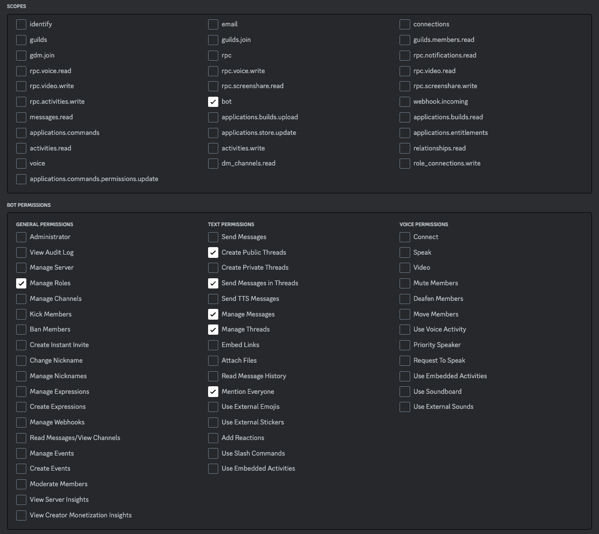

# InternalGov-2.0
A dedicated discussion forum within your Discord server, specifically designed to facilitate thoughtful and constructive conversations around incoming proposals. This interactive platform empowers members to openly share their insights, perspectives, and opinions on each referendum prior to the submission of an official vote by the designated proxy account on behalf of the collective or DAO.

The primary objective of this forum is to foster an environment of collaboration and informed decision-making, ensuring that every voice within the community is acknowledged and taken into consideration. By harnessing the collective wisdom of your community, you can make well-informed decisions that truly represent the best interests of the entire group.

We encourage everyone to actively participate in these discussions, as your input and feedback are invaluable in shaping the direction and outcomes of your collectives endeavors. Together, we can forge a stronger, more unified community that thrives on the principles of transparency, cooperation, and shared vision.


## Prereq(s)
#### Installing discord.py
###### Install the latest version of discord.py to interface with threads.
`pip3 install -U git+https://github.com/Rapptz/discord.py`


#### Installing PM2
###### PM2 is a daemon process manager that will help you manage and keep your application online 24/7 
`npm install pm2 -g`


## Initial setup
###### Discord API key
1. First, you'll need to create a new application on the [Discord Developer Portal](https://discord.com/developers/applications). If you don't already have an account, you'll need to sign up for one.


2. Once you're logged in to the [Discord Developer Portal](https://discord.com/developers/applications), click on the "New Application" button in the top right corner. Give your application a name and click "Create".  


3. Next, click on the "Bot" section in the left-hand menu and then click "Add Bot". Give your bot a username and profile picture, and click "Save Changes".  


4. The bot does not need require any Privileged Gateway Intents.


5. Under the "Token" section, click the "Copy" button to copy the API key. This key is what you'll use to authenticate your bot and allow it to interact with the Discord API.  


6. Under Oauth2 -> URL Generator select `bot` and then select: 

- Manage Roles

- Create Public Threads

- Send Messages in Threads

- Manage Messages

- Manage Threads

- Mention Everyone (This is required so that it can mention the notification role)



NOTE: `Manage Roles` is only needed initially to create the [SYMBOL]-GOV role to notify members to vote. You can either create the role yourself or remove `Manage Roles` permission once the role is created to limit any attack surface. The created role has no inherent permission and is only used for tagging.

7. Be sure to keep your API key secret! Don't share it with anyone or include it in any public code repositories.

###### server / forum id
1. Open Discord and click on the gear icon next to your username in the bottom left corner of your screen.


2. Under App Settings, click Advanced and enable Developer Mode


3. Right-click on your server and copy id. The same step is repeated for the forum channel.


```yaml
discord_api_key: <api-key>
discord_server_id: <server-id>
discord_forum_channel_id: <forum-id>
discord_lock_thread: 14
discord_role: <discord-role/leave blank for anyone to vote>
network: polkadot
token_decimal: 1e10
symbol: DOT
substrate_wss: wss://
```
note: `discord_role` is optional. If left as `null` it will allow anyone to cast a vote.

###### Daemonize the bot to run 24/7 with PM2
```shell
pm2 start main.py --name dotgov2 --interpreter python3
pm2 save
```